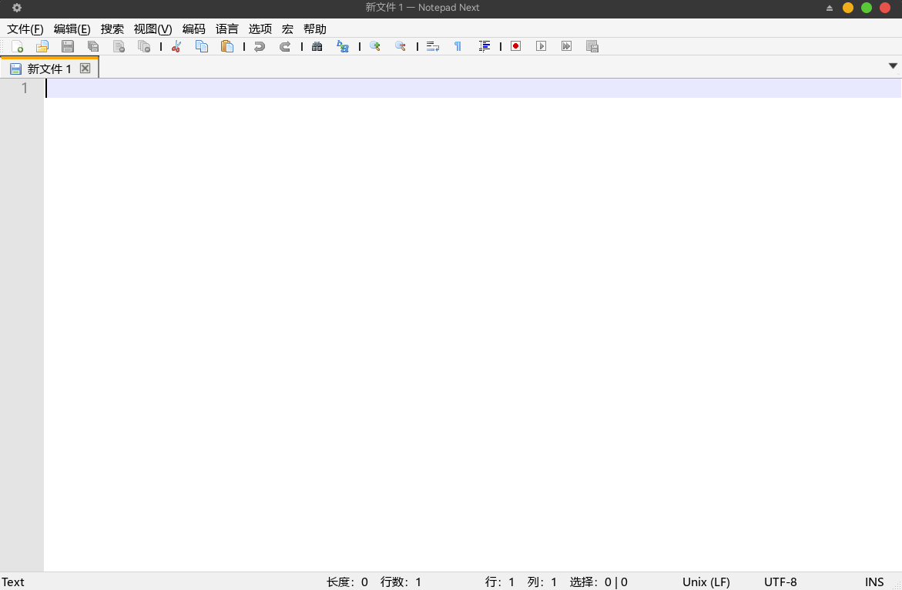
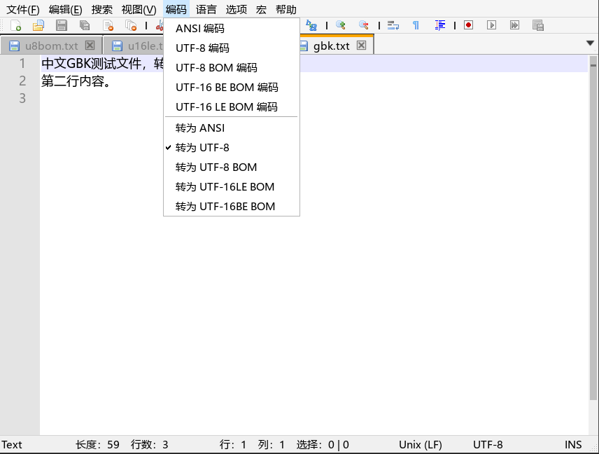
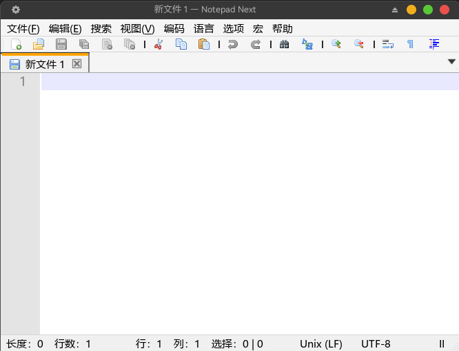

# Notepad Next（中文汉化 + 编码功能版）

本仓库是 [NotepadNext](https://github.com/dail8859/NotepadNext)（上游 v0.14） 的个人维护分支，跨平台、 Notepad++ 风格的文本编辑器。

程序整体稳定可用，但不应将其用于至关重要且不容出错的工作。

## 界面预览

主界面（中文菜单）：



文件编码菜单：



操作演示：



## 与上游版本相比的修改

1. **文件编码功能**（上游未实现，Encoding 菜单原本只有一个占位项）：
   - 打开自动识别编码：UTF-16 BOM → UTF-8 BOM → 严格 UTF-8 校验 → GB18030 兜底；修复上游 UTF-16 文件"打开乱码、保存损坏"的问题；
   - 菜单两组，语义对齐 Notepad++：**"X 编码"**（ANSI / UTF-8 / UTF-8 BOM / UTF-16 BE BOM / UTF-16 LE BOM）按指定编码重新解读文件字节，未编辑时直接重解码盘上原始字节且不脏化文档；**"转为 X"** 保持文本不变、只更换保存编码；
   - "ANSI" 映射为 GB18030（GBK 超集）；状态栏实时显示当前编码；
   - 顺带修复上游 `rename()` 成功/失败判断颠倒的 bug。
2. **标准对话框汉化**：保存/关闭确认框的"保存/不保存/取消"按钮通过回退加载系统 Qt 翻译（`qtbase_zh_CN.qm`）实现汉化。
3. **查找/替换对话框**：浅色主题样式，复选框显示真实对勾、单选框显示实心圆点；`Search Mode` 与 `Transparency` 分组标题和首选项的间距与选项间间距对齐。
4. **偏好设置对话框**：补全 23 条简体中文翻译（`i18n/NotepadNext_zh_CN.ts`、`i18n/NotepadNext_zh.ts`）。
5. **视图菜单**：折叠/展开所有层级、折叠/展开层级 1–9、缩放指示汉化，术语参照 Notepad++ 官方简体中文语言包。
6. **搜索菜单**：剪切/复制/删除书签行、用格式标记全部（使用格式 1–3）、清除格式标记系列汉化。
7. **全局菜单汉化审计**：脚本比对 `MainWindow.ui` 全部源文本与翻译状态，补漏 24 条——行操作（移除重复行/连续重复行、反转行顺序、六种排序）、标签页切换、切换改写模式、"在此打开终端"、文件被外部修改重载提示及全部文件 IO 错误标题等；剩余未译仅快捷键与符号按钮。
8. **列选模式提示**：编辑菜单新增「列选模式」项（位于「列编辑模式…」上方），点击弹出只读提示框说明两种列选操作方法（Alt+鼠标左键拖拽 / Alt+Shift+方向键）。两种方法均为 Scintilla 原生能力且已实测可用（注意：Xfce 桌面需在"窗口管理器→高级"中释放 Alt+拖拽 快捷键，鼠标法才会归编辑器响应）。
9. **帮助菜单**：移除 `Debug Info...` 入口；正式版本使用 `CMAKE_BUILD_TYPE=Release` 构建。

## 本地编译（Linux）

以下是在本机实测通过的编译流程（Arch Linux，Qt 6.11.2，CMake 4.4.3，GCC 16），其他 Linux 发行版步骤相同，只需先装好对应依赖。

### 1. 安装依赖

需要 CMake、C++ 编译器和 Qt6（含 LinguistTools 用于编译翻译；含 Core5Compat 供编码功能使用 `QTextCodec`）：

```bash
# Arch Linux（qt6-5compat 已在列）
sudo pacman -S base-devel cmake qt6-base qt6-tools qt6-5compat

# Debian / Ubuntu
sudo apt install build-essential cmake qt6-base-dev qt6-tools-dev qt6-5compat-dev
```

### 2. 克隆代码

```bash
git clone https://github.com/sunjunior/notepadnext.git ~/notepadnext/src/notepadnext
cd ~/notepadnext/src/notepadnext
```

### 3. 配置

```bash
cmake -S ~/notepadnext/src/notepadnext -B ~/notepadnext/src/notepadnext/build -DCMAKE_BUILD_TYPE=Release
```

### 4. 编译

```bash
cmake --build ~/notepadnext/src/notepadnext/build --target NotepadNext -j8
```

编译产物为 `~/notepadnext/src/notepadnext/build/src/NotepadNext`。翻译文件（`.ts`）在构建时由 `qt_add_translations` 自动生成 `.qm` 并打包进程序的 `:/i18n` 资源，无需手工执行 `lrelease`。

`build/`、`/.cpm-cache/` 等本地临时目录已在 `.gitignore` 中，不会进入仓库。

### 5. 安装与运行

```bash
sudo cp ~/notepadnext/src/notepadnext/build/src/NotepadNext /usr/bin/NotepadNext
NotepadNext
```

## AppImage 系统要求

Release 页提供的 `NotepadNext-v0.14-zh-x86_64.AppImage` 已内置 Qt 等主体依赖，用户侧只需满足（x86_64 Linux）：

1. **FUSE 2**（直接运行必需；不装也可用 `--appimage-extract-and-run` 参数启动）
   - Debian/Ubuntu/Mint/Pop!_OS：`sudo apt install libfuse2`
   - Fedora/Rocky/Alma：`sudo dnf install fuse-libs`
   - Arch/Manjaro：`sudo pacman -S fuse2`
2. **glibc ≥ 2.38**（可用 `ldd --version` 自查）

| 发行版 | glibc | 能否运行 |
| --- | --- | --- |
| Ubuntu 24.04 LTS / 25.04 / 25.10 | 2.39–2.41 | ✅ |
| Ubuntu 22.04 LTS 及更早 | ≤ 2.35 | ❌ |
| Debian 13 trixie | 2.40+ | ✅ |
| Debian 12 及更早 | ≤ 2.36 | ❌ |
| Fedora 39 / 40+ | 2.38+ | ✅（39 为临界版本） |
| Linux Mint 22.x / LMDE 7 | 2.39+ | ✅ |
| Linux Mint 21.x / LMDE 6 | ≤ 2.36 | ❌ |
| Rocky/AlmaLinux 10 | 2.39 | ✅ |
| Rocky/AlmaLinux 9 | 2.34 | ❌ |
| openSUSE Leap 16.0 / Tumbleweed | 2.40+ | ✅ |
| openSUSE Leap 15.6 | 2.38 | ✅（临界版本） |
| Arch / Manjaro / EndeavourOS（滚动） | 最新 | ✅ |
| Pop!_OS 24.04 | 2.39 | ✅ |

注：本包在 Arch（glibc 2.44）上构建，如需支持 Ubuntu 22.04 等老系统，需在老系统上重新打包。

## 开发

上游使用 QtCreator + MSVC 开发，要求 Qt >= 6.5。本分支同样可用 QtCreator 直接打开根目录 `CMakeLists.txt` 配置构建；更详细的官方构建说明见 [doc/Building.md](doc/Building.md)（英文）。

## License

本代码基于 [GNU General Public License v3](https://www.gnu.org/licenses/gpl-3.0.txt) 发布。
